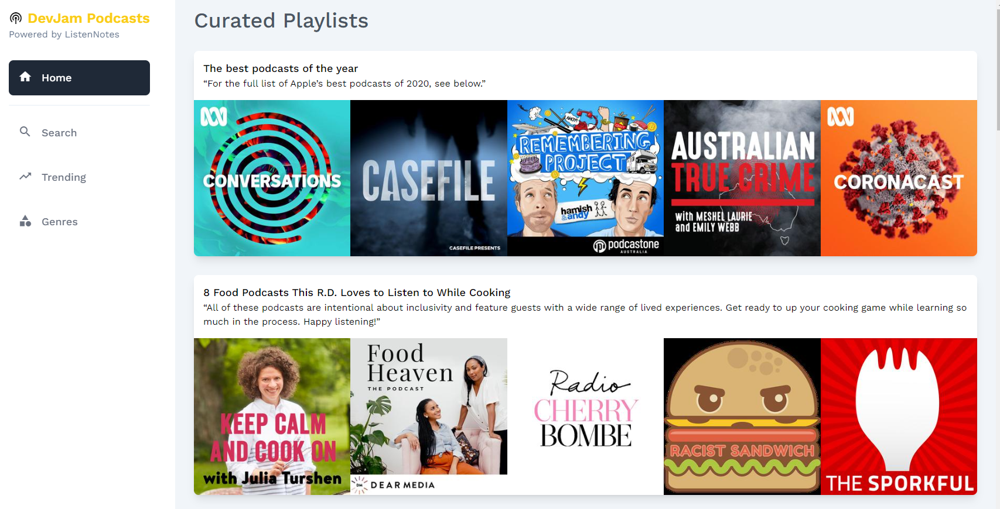

# DevJam Podcasts with Listen Notes API

[](https://github.com/RichardLitt/standard-readme)
[](https://angular.io/)
[](https://expressjs.com/)
[](https://opensource.org/licenses/MIT)

A podcast directory using the Listen Notes API.

## Live Demo

Find a live demo here: [Live Demo](#coming-soon)



## Table of Contents

- [Background](#background)
- [Install](#install)
- [Usage](#usage)
- [Maintainers](#maintainers)
- [Acknowledgements](#acknowledgements)
- [License](#license)

## Background

This project is created for the DevJam challenge. 
You can read more about the project specifications in the [specs](./SPEC.md).

## Install

This project uses [node](http://nodejs.org) and [npm](https://npmjs.com). Go check them out if you don't have them locally installed.

```sh
$ npm install
```

## Usage

The project requires two commands to run locally. 

### Server

```sh
$ npm start dev-server
# Starts a local express server
```

### Client app

```sh
$ npm run dev
# Starts the Angular client app
```

## Maintainers

[@dewald-els](https://github.com/dewald-els)

## Acknowledgements

- [Listen Notes API](https://www.listennotes.com/api/docs/)
- [TailwindCSS](https://tailwindcss.com/)
- [Google Material Icons](https://developers.google.com/fonts/docs/material_icons)

## Licence

[MIT](./LICENSE.md)
